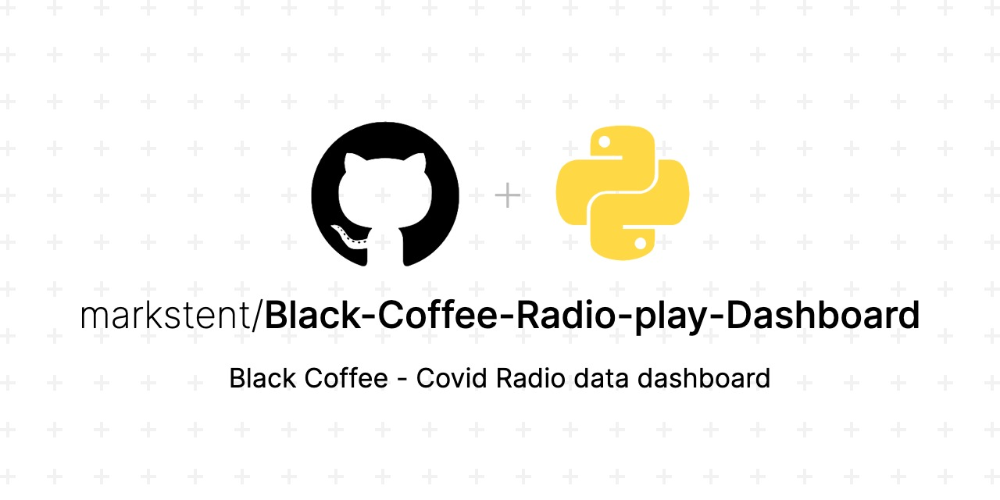

# Black Coffee Radio play dashboard

This was a project for my Master's degree. Black Coffee is a poplur artist from South Africa. I managed to get hold of a data set of his sales over the Pandemic period.
the South Africa Music Rights Organisation to make decisions on assisting struggling artists over this difficult period.
I built a dashboard to be used as a prototype for the South African Music Rights Organisation (SAMRO) to decide on how to assist struggling artists over the Covid period.

The visualisation can be found on Tableau Public [here](https://public.tableau.com/views/BlackCoffeeAnalysis/ArtistRadio-ActivityDashboard2020?:language=en-US&publish=yes&:display_count=n&:origin=viz_share_link).

My full report for the project can be found [here](Black_Coffee_Visualisation_report.pdf).

The Jupyter Notebook for the data cleaning can be found [here](Black_coffee_Datacleaning.ipynb)

## Technologies/Libraries used

- Tableau
- Pandas
- Numpy
- Python
- Visualisation
## Results

There was not enough data to make any real recommendations but the dashboard sits as a template to connect to bigger datasets to be used in the future.
## What I learned

How to use Tableau! I had a lot of fun making it and learning how powerful (and simple!) Tableau is to use.

## Feedback

If you have any feedback, please reach out to me at mark@markstent.co.za

